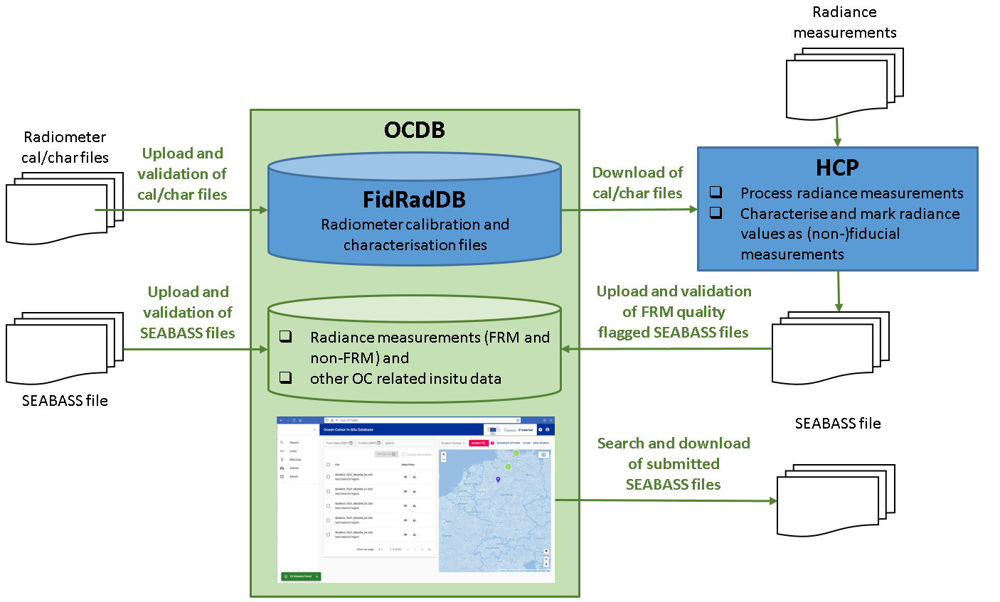

.. OCDB documentation master file, created by
   sphinx-quickstart on Fri Mar 22 09:46:22 2019.
   You can adapt this file completely to your liking, but it should at least
   contain the root `toctree` directive.

Welcome to the Copernicus Ocean Colour Database (OCDB) System!
======================================================
Comparison between simultaneous in-situ and satellite measurements are fundamental for satellite product validation,
to prove the accuracy and limitations of the data services.
In addition, in-situ measurements alone or combined with satellite products are required for Ocean Colour algorithm
development.
Considering the need for sustained access to in situ-Fiducial Reference Measurements for the Copernicus programme,
the aim of the Copernicus Ocean Colour Database (OCDB_) is to provide a platform to collect, organize and make
available to the ocean colour community:

1. ocean colour related in-situ measurements and

2. radiometer calibration and characterisation files

and to ensure long-term stewardship of these critical data.

The radiometer calibration and characterisation files are collected in the Fiducial Radiometer database FidRadDB_,
which is hosted by the OCDB.

This tool enables researchers to store their in-situ data and radiometer files in an organised Database and to share them,
if elected, in standardized file formats.

Only when elected by the contributor, in-situ measurements are published into the Database and made available to the public. 
Quality checks on format, measurements as well as on protocol compliance are performed, and a quality flag is provided for
each measurement.
 
Published, best quality data are used to generate Match-up files with Sentinel-3 Level 2 Ocean Colour OLCI A and B products which are also made available through the Database.

The Databases OCDB and FidRadDB have been designed in order to guarantee easy access to data, a strong search engine,
automation via command line access and interoperability with other Databases (in particular NASA SeaBASS Database).
The FidRadDB can be accessed by the Hyper OCR Community Processor, abbreviated HyperCP or HCP (Read more about HyperCP_).

         Go to the Copernicus OCDB_

.. _OCDB: https://ocdb.eumetsat.int

.. _FidRadDB: ./fidrad-database.html

.. _HyperCP: https://frm4soc2.eumetsat.int/HyperCP/

.. image:: static/webui/logos.png

.. toctree::
   :maxdepth: 2
   :caption: Contents

   ocdb-webui
   ocdb-api-cli
   ocdb-search
   ocdb-contribute
   ocdb-metadata-headers
   ocdb-standard-field-unit
   ocdb-suffix-modifiers
   ocdb-validation-config
   ocdb-data-policy
   ocdb-PI-affiliation-experiment-cruise
   fidrad-database
   fidrad-api
   ocdb-external-data-sources
   ocdb-MDB-user-manual
