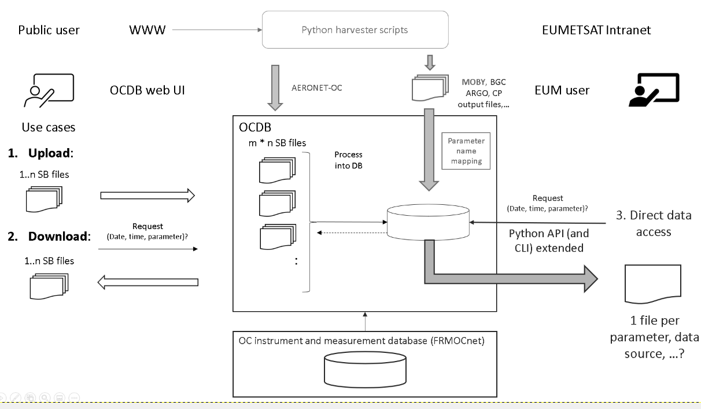
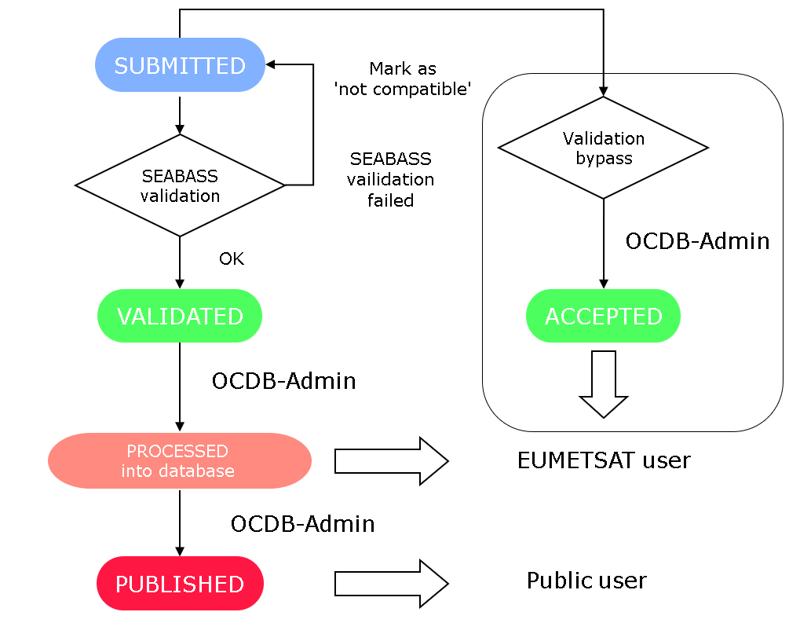
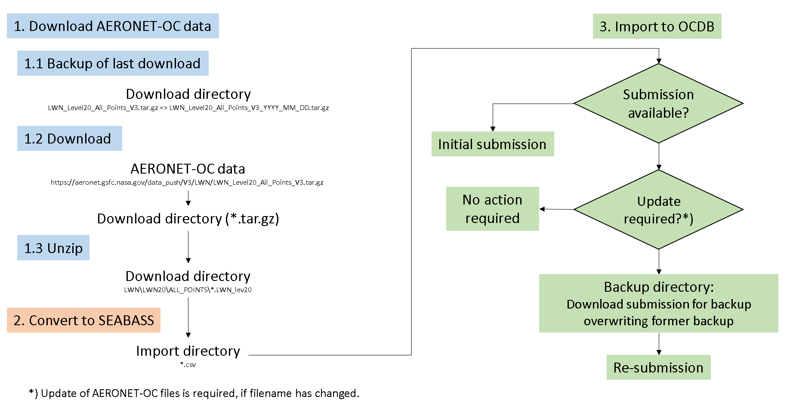
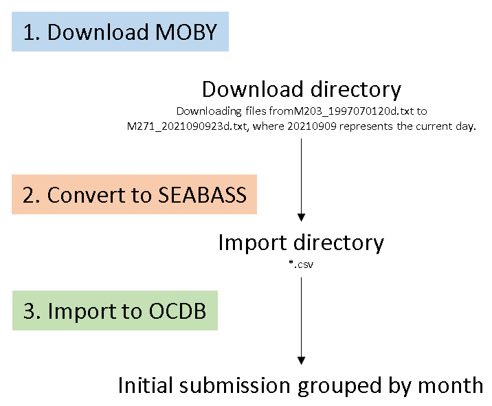

# External datasources

Ocean colour related insitu measurements are collected within the *Ocean Colour database OCDB*. Investigators can upload their data as text files in the *SEABASS* file format to make them publically available for download to other users.

__Fig. 1: Data flow diagram of the OCDB database.__

If uploaded data are compatible to *SEABASS*, they are categorised as validated automatically. Afterwards, an ODBC admininstrator can process the data files in the database and finally make them publically available. Not valid data sources can be categorised as accepted by an administrator to make the data files available for *EUMETSAT*-internal use.

__Fig. 2: *OCDB* validation proces as flow diagram.__

Data from external datasources such as *AERONET-OC*, *MOBY* buoy data and *biogeochemical ARGO* (*BGC ARGO*) shall be ingested into the *OCDB*. Data shall be accessible by *EUMETSAT* users only and will not provided for download by the *OCDB* web user interface to avoid redundancy in the WWW.

## AERONET-OC data (SEABASS compatible text files) ##

*AERONET-OC* data are downloaded from [https://aeronet.gsfc.nasa.gov/](https://aeronet.gsfc.nasa.gov/data_push/V3/LWN/LWN_Level20_All_Points_V3.tar.gz) and converted to *SEABASS* file format. Each file representing time series of radiance measurement at a certain *AERONET* Platform, is then submitted to *OCDB*.

__Fig. 3: Flow diagram illustrating the download, conversion and ingestion of *AERONET-OC* data files in the *OCDB* database.__

## MOBY data (SEABASS incompatible text files) ##

*MOBY* data can be downloaded from [https://www.star.nesdis.noaa.gov/](https://www.star.nesdis.noaa.gov/socd/moby/filtered_spec/). They are converted to a text file format similar to *SEABASS*. Due to the fact, that *SEABASS* data files contain time series data and *MOBY* data are hyperspectral datasets, the latter format per se is not *SEABASS* compatible. However, a match with *SEABASS* can be achieved by transposing the data, i. e. by converting rows to columns and vice versa.

## BGC ARGO data ##

Download of *biogeochemical ARGO* data (*BGC ARGO*) is possible via [https://data-argo.ifremer.fr/dac/](https://data-argo.ifremer.fr/dac/). These *ARGO* data are provided as netCDF files. A concept to integrate the data to the *OCDB* system will be developed.

__Fig. 4: Flow diagram illustrating the download, conversion and ingestion of *MOBY* buoy data files in the *OCDB* database.__
