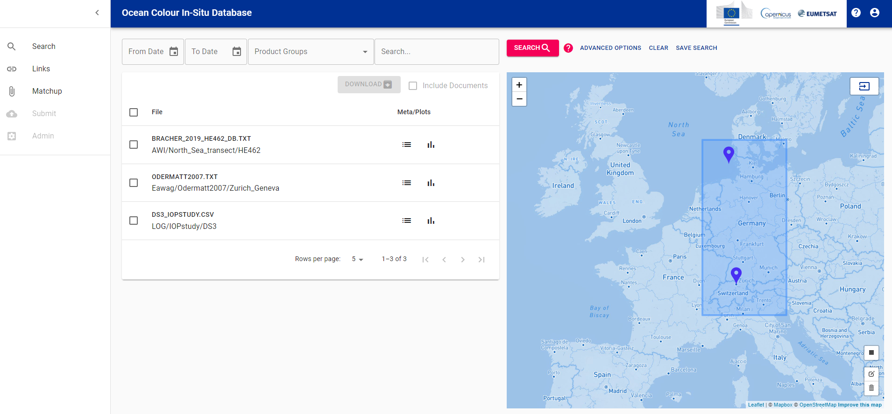
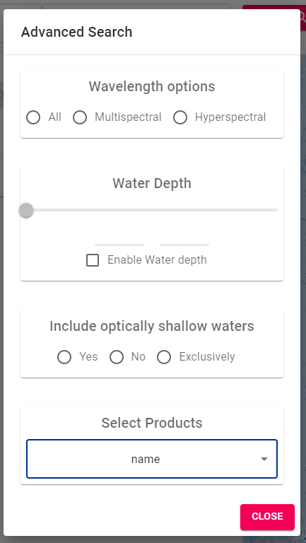
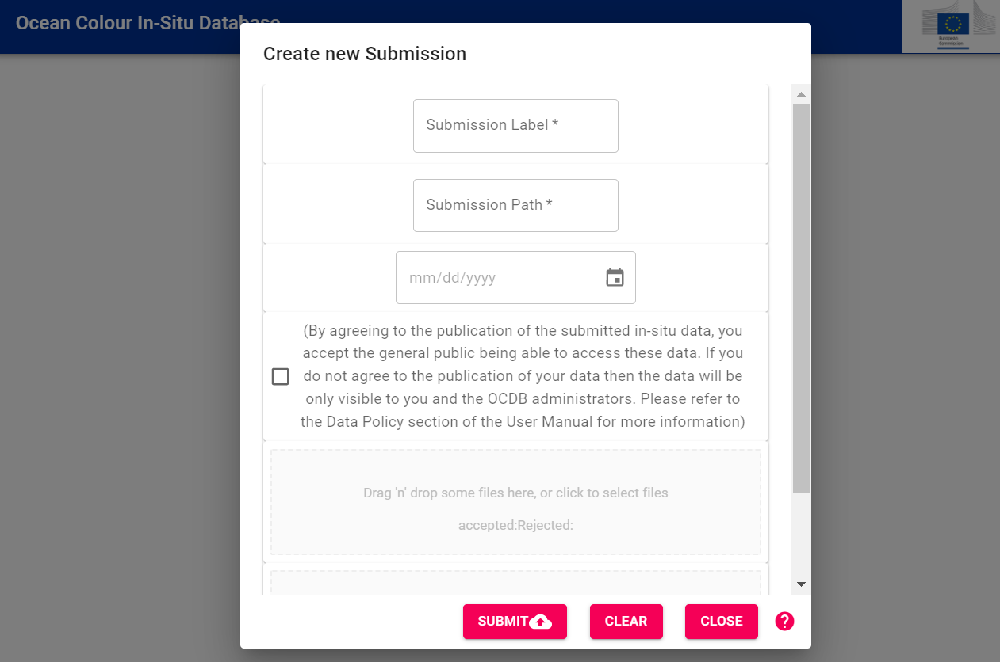
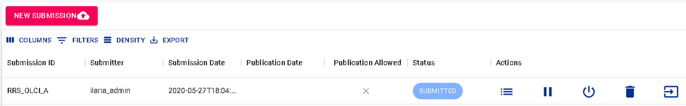
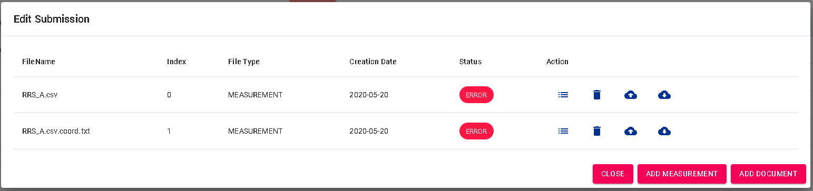
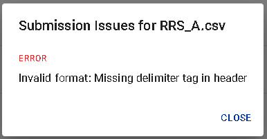
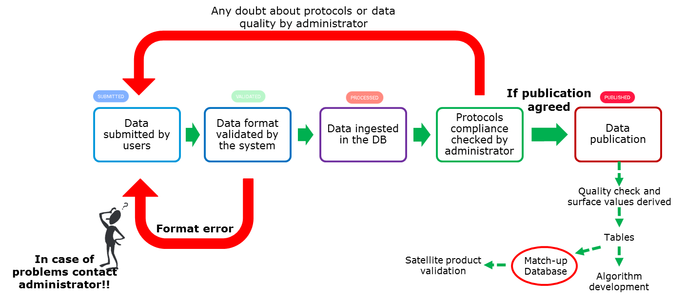

# User Manual for the OCDB WebUI

The main feature of the OCDB Database system is the stewardship and provision of
high-quality in-situ data to the Ocean Colour community through an enhanced search
facility. 

## Search webpage: Search and retrieve in-situ data

The OCDB WebUI offers a _Search_ interface. Data can be searched by acquisition date,
product groups and a _Search_ text field. Advanced options allow filtering for:

1. multi- and/or hyperspectral data,
2. water depth,
3. measurements in optical shallow water (no, yes, exclusively) and
4. products.

In the _Search_ text field, users can enter any word(s) that will be used to screen the
Database for any file containing that word(s). This field also allows the use of the
so-called Lucene syntax which enables searches for specific field values and also allows
chaining.

Please refer to the [__Search__](ocdb-search.md) chapter, for a complete list of product
groups and more details about the Lucene search syntax.

Note that only those data which were elected for publication by their submitter, are available in searches. 

### Set region
Region for a spatial search can be set in different ways:

1. entering coordinates by clicking on 'MANUALLY ENTER COORDINATES' button,
2. drawing a polygon on the map or
3. using lucene syntax (see sample in [OCDB search](ocdb-search.md))

### Advanced options

In advanced options menu, The wavelength option allows to filter __hyperspectral__ and __multispectral__ measurements. However, the categorisation of datasets as multi- or hyperspectral according to SEABASS is not implemented yet.

__Water depth__ threshold can also be set (when provided in metadata). Water depth must be specified by the mandatory metadata header water_depth.

Measurements taken in optically shallow waters can be either excluded or selected. This characteristic can be
defined in the metadata header field "data_use_warning" by stating "/data_use_warning=optically_shallow".

Finally, user can select a __single product__ to be used as search criteria (a list of standard names for variables is available [here](ocdb-standard-field-unit.md)).

### Save search

Any query can be saved for replicating the same search again during the current session
(search options are saved, not the results!). Click on _SAVE SEARCH_ and assign a name to it.
Search query can be edited and/or shared by clicking on _<>_ button.

## Submit webpage: Upload Data

In this section the data submission process is described. Only registered users are allowed
to submit data. Please contact ops@eumetsat.int to be registered. Registered users after
login can manage new and past submission in the _Submit_ page.

### New Submission

To add a __new submission__, go to _Submit_ page and click on _NEW SUBMISSION_ in the top
left corner. A new dialog will open. Please add an identifier (_Submission Label_) for the
submission and a path (_affiliation/experiment/cruise_) where submission files will be stored.

The submission label must univocally refer to the submission, while submission path could be
the same for multiple submissions.

By checking _Publish Data_ the user agrees to publish the data.

Selecting a date in _Publication Date_ will delay the publication of the data belonging to
this submission. Data for which the publication is not allowed by the submitting person
can be stored in the Database but are accessible to the Database administrators as well
as to the owner of the data. An agreement to publish can also be provided or rejected
anytime in the future by contacting ops@eumetsat.int.

Drag and drop or select measurement and documentation files in the dedicated windows.
File format and documentation required are described [here](ocdb-contribute.md).
Click on _SUBMIT_ to initiate the validation process. Files containing measurements are
immediately automatically checked according to [validation rules](ocdb-validation-config.md).

After going through an automated quality check valid files will be uploaded to OCDB
(Status VALIDATED). Invalid files will be uploaded as well having the status SUBMITTED
(but not valid), i. e. INVALID.

After upload, the files' content is transferred to the database by an OCDB administrator
(admin action _Process Submission into DB_). A second admin action will make the datasets
publicly available, if elected by the submitting person.

Submissions containing errors (status SUBMITTED / INVALID) are not further processed into the Database.

In case of errors or warnings, for each submission, click on 
_List Files_ to open a dialog listing all data and documentation files and showing the
results of the validation, shown for each data file:

In the dialog click on  _List import Issues_ to show the list of
error and warning messages, e. g.:

If you need assistance, please contact ops@eumetsat.int indicating the identifier
(_Submission label_) of the submission.

Using the __action tools__ single files can be thus downloaded ,
re-uploaded  and validated again.

If the validation succeeds, the status of the submission is set to _VALIDATED_ and can further
be processed into the database by database administrators.

The picture below, summarises the whole process for submission and data validation.

### Submission Actions 
In _Submit_ page, any registered user, after login, can manage their own submissions and submission files.

Each submission is listed with its label, submission date, (if provided) publication date, publication agreement,
submission status and available actions.

__List Files__: 

It shows a table of selected submission files. Actions are applicable for each file (see _Submission File Actions_
section below).

__Process Data__ (Admin users only):

Before they are processed, validated data are still not visible in the Database to anyone. __Process Data__
allows to start the processing action, at the end of which the data are searchable in the Database, but __ONLY__
to admin users and the owner of the data. 

__Publish Data__ (Admin users only):

With _Publish Data_ data are processed (if not processed yet) into the Database and the status of the data is set
to __PUBLISHED__ and data are, therefore, searchable by the public in the Database. The publishing process checks
whether the data has already been processed, to avoid data duplication.

__Delete Submission__ (Admin users only):

The whole submission is deleted, including processed/published data from the database.
 
__Halt/Restart Submission__ (Admin users only):

The user is able to halt a submission. This will denote the administrators that the user wishes that the submission is
__NOT__ to be processed. Once the process is halted, a __Restart__ button will appear, and user can use it to
communicate submission can be processed now.

__Cancel Submission__ (Admin users only):

Cancelling the submission allows to delete the database entries linked to this submission, keeping submission files.
This data can be anytime re-processed into the Database from the _Submit_ page.

### Submission Status

For each file, the following status can be set:

- __SUBMITTED__: submission contains errors and could not be validated
- __VALIDATED__: all submission files passed file format check (no errors, warnings allowed)
- __CANCELLED__: database entries linked to this submission have been cancelled from the Database
- __PAUSED__: database entries linked to this submission have been paused by an OCDB administrator for further
  analysis, e. g. requests to the submitting person
- __PROCESSED__: submission data are searchable in the Database via the search page by submission owner and admin users
- __PUBLISHED__: submission data are searchable in the Database via the search page by anyone

Whenever a submission is updated, its status in the submission page is set accordingly to _SUBMITTED_ or _VALIDATED_ again. 
On the other hand, files already published and searchable are not updated until the new/updated files are processed
by Database administrators. Instead, the oldest version remains available.

### Submission File Actions

When clicking on listing files, the data and document files of the respective submission are listed at the end of the page.
This new table provides the following actions:

__List Import Issues__:

List issues the system encountered when validating the data file.

__Delete File__:

Remove the file from the submission.

__Download File__:

Download the file if a change to the submission file is required.

__Upload File__:

Re-upload a new version of the file. The old one is overwritten. The validation is re-run.

### Submission File Status

For each file, the following status can be set:

- __ERROR__: there are errors in the format of the file
- __WARNING__: there are warnings regarding the format of the file. 
- __OK__: the file passed the format quality check
